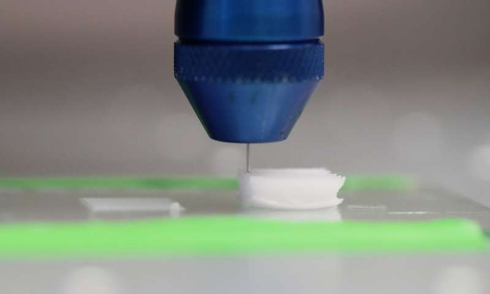

```{r setup, include=FALSE}
knitr::opts_chunk$set(echo = FALSE)
```




## URL link to the article:
https://www.eurekalert.org/pub_releases/2019-09/lu-nbm093019.php

## Vocabulary

| Words from the text | Synonym/explanation in English |
| ------------------- | ------------------------------ |
| E.g. To cope with   | To deal with                   |
|                     | Not too distant future         |

## Analysis table 

|                              |                                                                     |
| ---------------------------- | ------------------------------------------------------------------- |
| Researchers                  | ()                        |
| Published in?                | (09-30-2019)                                                       |
| General topic?               |  (summarize the topic in one or two sentences)                      |
| Procedure/what was examined? | (Give some details about the topic, i.e. methodology/material/etc.) |
| Conclusions/discovery?       |  (what did the researchers conclude? Did they find something?)      |
| Remaining questions?         | (check if there are still interrogations at the end of the article) |

:
<https://www.eurekalert.org/pub_releases/2019-09/lu-nbm093019.php>
