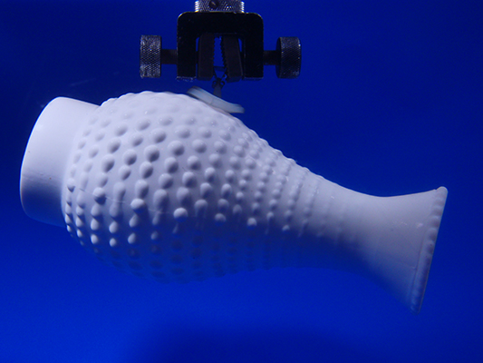

```{r setup, include=FALSE}
knitr::opts_chunk$set(echo = FALSE)
```




## URL link to the article:

click [here](https://ucsdnews.ucsd.edu/pressrelease/clingfish) to see the article.

## Vocabulary


## Analysis table 


:

